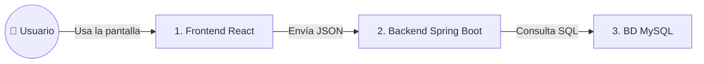

# 🧠 GUÍA DEFITINIVA DE SUSTENTACIÓN TÉCNICA - WORKINX
## (Edición de Lectura Fácil, Visual y Adaptada para TDAH)

---

> [!TIP]
> **¿CÓMO USAR ESTA GUÍA?**  
> Esta guía usa **analogías del mundo real**, **emojis**, **tarjetas de lectura rápida** y **caja de ideas clave**. No necesitas leer todo de un solo tirón. Ve paso a paso.

---

## ⚡ RESUMEN RELÁMPAGO (Para aprender en 2 minutos)

1. **¿Qué es WorkInX?:** Una plataforma web para conectar a jóvenes sin experiencia laboral con empresas mediante **entrevistas directas**.
2. **Arquitectura:** **Desacoplada**. El **Frontend (React)** y el **Backend (Spring Boot)** son dos aplicaciones separadas que hablan enviando mensajes en formato **JSON**.
3. **Seguridad:** 
   - **JWT:** Es como la **manilla VIP de una discoteca**. Te la dan al hacer Login y la muestras en cada puerta.
   - **BCrypt:** Es un **encriptador de contraseñas** que le da 10 vueltas de tuerca para que nadie las pueda adivinar.
4. **Base de Datos:** Usa **MySQL**. 
   - **HikariCP (Pool):** Es una flotilla de **10 taxis con motor encendido** listos para llevar datos sin perder tiempo.
   - **`JdbcTemplate`:** Es el escudo que evita que te vulneren con **SQL Injection**.
5. **Hojas de Vida (CV):** El PDF se guarda en la carpeta física `backend/uploads/cv/`. En la base de datos solo se guarda la ruta en texto.

---

## 📁 1. ¿QUÉ HACE CADA CARPETA DEL PROYECTO?

```text
WorkInX/
 ├── backend/    ──► 🧠 EL CEREBRO (Java + Spring Boot)
 ├── frontend/   ──► 🎨 LA CARA VISUAL (React + Vite)
 ├── database/   ──► 📦 EL ALMACÉN (Scripts SQL y Triggers)
 └── docs/       ──► 📚 LA BIBLIOTECA (Manuales del SENA)
```

- **`backend/`**: Procesa la seguridad, calcula datos y habla con la base de datos.
- **`frontend/`**: Es la pantalla que ve el usuario en el navegador (botones, colores, formularios, mapas).
- **`database/`**: Contiene las instrucciones SQL para crear las tablas y las reglas automáticas (Triggers).
- **`docs/`**: Contiene la documentación técnica para la entrega final del SENA.

---

## ⚡ 2. ¿QUÉ HACEN LOS ARCHIVOS JAVASCRIPT EN EL FRONTEND?

En la carpeta [`frontend/src/`](file:///c:/xampp/htdocs/WorkInX/frontend/src) están los archivos `.js` y `.jsx`. Piénsalos como los "músculos" de la pantalla:

- **`services/api.js`**: Es el **mensajero**. Toma las órdenes de React y las envía al puerto 3000 del Backend.
- **`context/AuthContext.jsx`**: Es la **memoria de sesión**. Recuerda si el usuario es un Candidato o una Empresa.
- **`hooks/useAuth.js`**: Es la **llave rápida** para pedir los datos de sesión desde cualquier botón.
- **`components/MapaPicker.jsx`**: Es el **mapa interactivo** (Leaflet) para poner el pin de la entrevista.
- **`pages/*.jsx`**: Son las **pantallas completas** (`Login.jsx`, `Registro.jsx`, `Entrevistas.jsx`, `PerfilUsuario.jsx`).

---

## 🏛️ 3. ARQUITECTURA DE SOFTWARE (Explicada con Manzanas)

WorkInX tiene una **Arquitectura Cliente-Servidor Desacoplada (SPA + API RESTful Stateless)**.

> 💡 **ANALOGÍA DEL RESTAURANTE:**
> - **El Frontend (React):** Es la **mesa y el menú elegante** donde se sienta el cliente.
> - **El JSON:** Es la **comanda de papel** donde se anota el pedido.
> - **El Backend (Spring Boot):** Es la **cocina** que prepara los datos.
> - **La Base de Datos (MySQL):** Es la **despensa** donde están los ingredientes guardados.



---

## 🧩 4. CAPAS DE DISEÑO vs. PATRONES DE DISEÑO

> [!NOTE]
> **Diferencia clave:**  
> - **Capas de Diseño:** Es como se divide la **CASA** (Cocina, Sala, Cuarto, Baño).
> - **Patrones de Diseño:** Es como organizas los **MUEBLES** dentro de cada cuarto para no tropezar.

### Capas de Diseño en WorkInX:
1. **Presentación (React):** Lo visual.
2. **Controlador (`@RestController`):** Quien recibe la llamada en la puerta.
3. **Servicio (`@Service`):** Quien hace el trabajo duro de negocio.
4. **Persistencia (`JdbcTemplate`):** Quien guarda los datos en MySQL.

---

### Patrones de Diseño Usados en Código (Con Ejemplos Cortos):

#### A. DTO (Objeto de Transferencia de Datos)
> 💡 **ANALOGÍA:** Es como un **sobre cerrado de correo**. Solo metes la carta que necesitas enviar, no metes todo tu closet.

En [`LoginRequest.java`](file:///c:/xampp/htdocs/WorkInX/backend/src/main/java/com/workinx/backend/dto/LoginRequest.java):
```java
@Data
public class LoginRequest {
    private String correo;
    private String password;
}
```
* **¿Por qué se usa?:** Porque evita que un hacker envíe en el JSON un campo malicioso como `"rol": "admin"`. El DTO solo acepta el correo y la clave.

---

#### B. Inyección de Dependencias (DI)
> 💡 **ANALOGÍA:** Es como un **tomacorriente**. En lugar de construir una planta eléctrica dentro de tu TV, solo te "conectas" a la energía.

En [`AuthController.java`](file:///c:/xampp/htdocs/WorkInX/backend/src/main/java/com/workinx/backend/controller/AuthController.java):
```java
public AuthController(AuthService authService) {
    this.authService = authService; // Spring te "entrega" la instancia lista
}
```

---

#### C. Singleton
> 💡 **ANALOGÍA:** Es como el **reloj de la plaza del pueblo**. Hay uno solo y todos lo miran.

Spring crea **una sola instancia** de `AuthService` o `PasswordEncoder` en toda la memoria RAM de la máquina para no malgastar recursos.

---

#### D. Provider / Context (React)
En [`AuthContext.jsx`](file:///c:/xampp/htdocs/WorkInX/frontend/src/context/AuthContext.jsx):
Le da la información del usuario a cualquier pantalla de React sin tener que pasar datos de mano en mano por 20 componentes.

---

## 🔒 5. CAPAS DE SEGURIDAD (Explicadas de Forma Sencilla)

```text
🔒 [Petición HTTP]
   ├── 1. DTO: Filtra los campos basura.
   ├── 2. JWT Filter: Revisa la "Manilla VIP" (Token).
   ├── 3. Spring Security: Verifica si el rol es "ROLE_EMPRESA" o "ROLE_CANDIDATO".
   ├── 4. BCrypt: Cifra las claves en texto plano.
   └── 5. Prepared SQL (?): Bloquea los ataques de Inyección SQL.
```

1. **JWT (JSON Web Token):** Cuando entras al sistema te dan una "manilla VIP". En cada clic, tu navegador envía esa manilla en la cabecera `Authorization: Bearer <token>`.
2. **BCrypt Hash:** Le da 10 vueltas de encriptación a la clave. Si la clave es `Hola123!`, la guarda como `$2a$10$e8W...`. Nadie la puede desencriptar.
3. **Prevención de SQL Injection:** Usamos `?` en las consultas de SQL. Si alguien escribe un código malo en el login, MySQL lo trata como simple texto inofensivo.

---

## 🗄️ 6. CONEXIÓN A BASE DE DATOS, HIKARICP Y ACID

### ¿Qué es HikariCP (Pool de Conexiones)?
> 💡 **ANALOGÍA:** Imagina 10 taxis parados afuera de un hotel con el motor encendido. Cuando sale un huésped, sube de inmediato. No hay que esperar a llamar al taxi.

Configuración en [`application.properties`](file:///c:/xampp/htdocs/WorkInX/backend/src/main/resources/application.properties):
```properties
spring.datasource.hikari.maximum-pool-size=10
```

### ¿Qué es ACID?
Son las 4 reglas mágicas de MySQL para que los datos jamás se dañen:
- **A (Atomicidad):** "O se guarda todo, o no se guarda nada" (Si falla la mitad, se devuelve con Rollback).
- **C (Consistencia):** La base de datos no acepta datos raros que rompan las reglas.
- **I (Aislamiento):** Si dos personas se postulan al mismo tiempo, la base de datos las atiende en filas separadas.
- **D (Durabilidad):** Una vez guardado, aunque se vaya la luz, la información ya quedó fija en el disco.

### ¿Dónde están los Triggers?
En [`database/procedures_triggers.sql`](file:///c:/xampp/htdocs/WorkInX/database/procedures_triggers.sql).  
**Ejemplo de Trigger de Moderación:** Si una oferta laboral recibe **3 denuncias de usuarios**, el Trigger de MySQL la apaga automáticamente (`activa = FALSE`).

---

## 📂 7. ¿DÓNDE SE GUARDAN LAS HOJAS DE VIDA (CV)?

1. **El PDF Físico:** Se guarda en el disco duro en la carpeta [`backend/uploads/cv/`](file:///c:/xampp/htdocs/WorkInX/backend/uploads/cv/).
2. **En MySQL:** Solo se guarda el texto con la ruta: `"uploads/cv/1757280000_mi_cv.pdf"`.
3. **En el Navegador:** Se puede abrir con la dirección `http://localhost:3000/uploads/cv/1757280000_mi_cv.pdf`.

---

## 📦 8. ¿CÓMO SE COMPILA Y DESPLIEGA EL PROYECTO?

- **El Frontend (React):**
  - Comando: `npm run build`
  - ¿Qué hace?: Toma todo el código JSX y CSS y lo comprime en una carpetica llamada `dist/`.
  - ¿Dónde se pone?: En cualquier servidor web como Vercel, Netlify o Apache (XAMPP).
- **El Backend (Spring Boot):**
  - Comando: `./mvnw clean package`
  - ¿Qué hace?: Junta todo el código Java en un solo archivo empaquetado llamado `workinx-backend-1.0.0.jar`.
  - ¿Dónde se pone?: En un servidor con Java instalado usando el comando `java -jar workinx-backend-1.0.0.jar`.

---

## 🔄 9. FLUJO DE DATOS DEL POSTULANTE (Paso a Paso)

```text
 1. Candidato da clic en "Postularme" en React.
 2. Selecciona su archivo PDF (max 5MB).
 3. api.js le pega la "Manilla VIP" (JWT) a la petición.
 4. Pasa por el filtro de seguridad JwtAuthFilter en Spring Boot.
 5. PostulacionesController.java recibe el archivo.
 6. PostulacionesService.java guarda el PDF en backend/uploads/cv/.
 7. Inserta en la tabla postulaciones de MySQL usando JdbcTemplate.
 8. React recibe respuesta exitosa (HTTP 201) y muestra el letrero verde "✅ Postulado".
```

---

## 🎙️ 10. GUIÓN PARA HABLAR EN LA SUSTENTACIÓN (Speech Corto)

> **"Buenos días jurado.**  
> Presentamos **WorkInX**, una plataforma web diseñada para conectar a jóvenes sin experiencia laboral con empresas a través de **entrevistas directas**.
>
> Desarrollamos el proyecto con una **Arquitectura Desacoplada**:  
> - Un **Frontend en React 19** para una navegación rápida sin recargar pantalla (SPA).  
> - Un **Backend en Spring Boot 3** con Java 17 que provee una API REST.  
> - Una base de datos **MySQL** optimizada con el pool de conexiones **HikariCP**.
>
> La seguridad utiliza **JWT Stateless** y cifrado de claves con **BCrypt**. El sistema además incluye **Triggers de moderación comunitaria** que desactivan automáticamente publicaciones sospechosas tras 3 reportes. Quedamos atentos a sus preguntas."

---

## ❓ 11. BATERÍA DE 5 PREGUNTAS CLAVE DEL JURADO Y RESPUESTAS RÁPIDAS

1. **¿Por qué no usaron un ORM como Hibernate?:**  
   *"Usamos `JdbcTemplate` para tener control total de las consultas SQL, evitar lentitud de memoria y aprovechar al máximo el pool HikariCP."*
2. **¿Qué pasa si cambias el token JWT en el navegador?:**  
   *"Se rompe la firma digital HMAC-SHA256, el filtro `JwtAuthFilter` lo detecta y rebota la petición con error 401 Unauthorized."*
3. **¿Cómo evitan que suban archivos maliciosos en la CV?:**  
   *"Validamos la extensión estrictamente a `.pdf`, `.doc`, `.docx` y limitamos el tamaño máximo a 5MB."*
4. **¿Por qué la navegación en React no recarga el navegador?:**  
   *"Porque es una Single Page Application (SPA). React Router cambia los componentes en pantalla usando la API de historia del navegador sin pedir nuevos archivos HTML al servidor."*
5. **¿Cómo evitan inyección SQL?:**  
   *"Todas las consultas usan `PreparedStatement` mediante `JdbcTemplate` con el símbolo `?`, lo que obliga a MySQL a tratar cualquier entrada del usuario como simple texto."*
